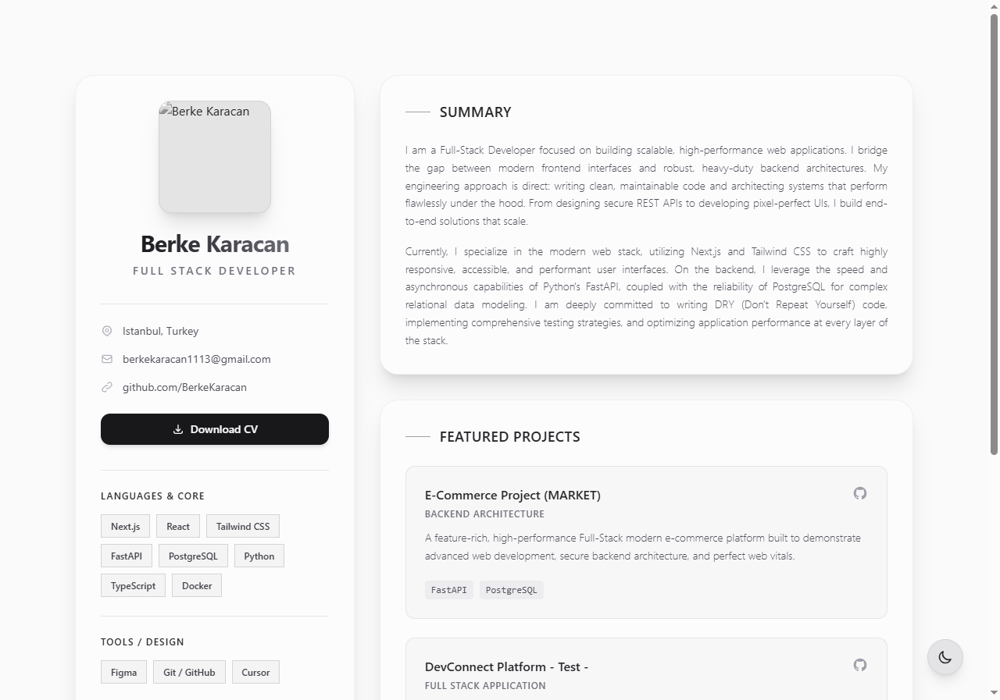

# Berke Karacan | Full Stack Developer Portfolio

> A modern, highly performant, and SEO-optimized portfolio website built to showcase my projects, skills, and professional journey as a Full Stack Developer.

## 🚀 Overview

This portfolio is architected with modern web technologies, focusing on absolute performance, perfect Web Vitals, and seamless user experience. It features a complete dark/light theme integration with glassmorphism design principles, secure metadata handling, and real-time analytics.

**Live Site:** [https://berkekaracan-portfolio.vercel.app/](https://berkekaracan-portfolio.vercel.app/)

## 🛠️ Tech Stack

- **Framework:** Next.js (App Router)
- **Styling:** Tailwind CSS v4
- **Theming:** next-themes (Class-based dark mode)
- **Fonts:** next/font (Geist & Geist Mono)
- **Analytics & Performance:** Vercel Analytics & Speed Insights
- **Deployment:** Vercel

## ✨ Key Features

- **Flawless Theme Switching:** Fully integrated Dark/Light mode utilizing next-themes and Tailwind v4's explicit `dark:` variants.
- **Glassmorphism UI:** Custom-built GlassCard components offering a premium aesthetic in both light and dark environments.
- **Advanced SEO & Metadata:** Dynamic OpenGraph cards, proper semantic HTML, and JSON-LD Schema Markup.
- **Hydration Safe:** Explicitly handles Next.js SSR and Client mismatches.
- **Force Dynamic Rendering:** Configured to avoid build conflicts with backend services.
- **Downloadable CV:** Direct access to a professional resume via a styled action button.

## 💻 Getting Started

To run this project locally:

1. **Clone the repository:**

   git clone https://github.com/BerkeKaracan/My-WebSite.git

2. **Install dependencies:**

   npm install

3. **Run the development server:**

   npm run dev

## 🤝 Contact

- **Email:** berkekaracan1113@gmail.com
- **GitHub:** [github.com/BerkeKaracan](https://github.com/BerkeKaracan)
